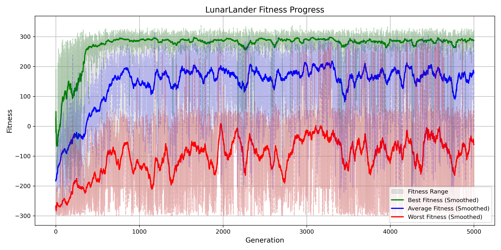
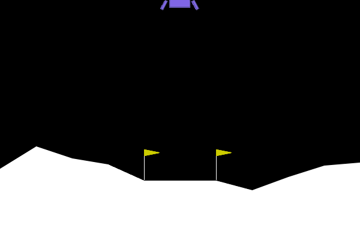

# Neuroevolution LunarLander-v3

This project explores how simple genetic algorithms can be used to solve reinforcement learning environments by evolving neural networks, completely bypassing traditional gradient-based methods like backpropagation.

The task tackled here is the classic [LunarLander-v3](https://gymnasium.farama.org/environments/box2d/lunar_lander/) environment from OpenAI Gymnasium. The objective is straightforward: safely land a spacecraft between two flags on the lunar surface while minimizing fuel consumption and avoiding crashes.

Instead of relying on gradient descent to optimize a neural network, this implementation evolves a population of neural networks by evaluating their fitness through direct interaction with the environment.

At its core, each neural network’s weights are represented as a flat genome — a simple array of numbers. These genomes undergo mutation through Gaussian noise, crossover between parents, and are selected based on their performance in the environment. The only feedback they receive is their fitness score: how well they land the lander and minimize fuel waste.

Throughout this project, I explored different techniques for crossover and mutation, analyzing how various strategies affect learning speed, diversity, and stability. Small tweaks in how information is exchanged between generations often lead to very different behaviors and learning dynamics.

Over the course of generations, the population gradually improves. LunarLander is a challenging environment due to its complex dynamics, multiple discrete actions, and delayed consequences of control decisions. This project demonstrates how evolutionary strategies can achieve competent behavior without gradients, backpropagation, or differentiability.

## How it Works

The architecture used is a small feedforward neural network with one or two hidden layers. It receives the environment’s eight observations (position, velocity, angle, leg contacts, etc.) and outputs a discrete action: do nothing, fire left thruster, fire main engine, or fire right thruster.

The training loop evaluates each neural network by running full episodes in the LunarLander environment. Better-performing networks survive and reproduce through crossover and mutation, while weaker ones are discarded. Over time, this survival-of-the-fittest mechanism leads to more capable controllers that reliably achieve soft landings.

Typical progress over generations looks like this:

- Early generations: landers spin, crash, or waste fuel randomly.

- Middle generations: landers survive longer but remain inefficient.

- Later generations: landers achieve controlled, efficient, and safe landings consistently.

<p align="center">  </p>

## Results

Despite the simplicity of the approach, the algorithm can consistently learn to solve LunarLander after enough generations. The neural networks discover stable landing behaviors purely through mutation, selection, and persistence, without any explicit knowledge of physics or control theory.

The best-performing agents can be saved and visualized. Here's an example of a successful landing generated entirely through evolution:

<p align="center">  </p>

## Why this Project

The aim was to explore neuroevolution as an alternative to traditional reinforcement learning in environments with complex dynamics and discrete controls. While evolutionary algorithms are not the most common choice for modern reinforcement learning, they remain elegant, intuitive, and robust methods for solving environments where gradients are unavailable, unreliable, or unnecessary.

This project serves as a minimal but complete example of how simple principles of evolution can lead to competent behavior in reinforcement learning environments. It also provides a foundation for experimenting with more complex tasks or more advanced evolutionary strategies.

## Dependencies

To run this project, install the dependencies with the following command:

```bash
pip install -r requirements.txt
```


